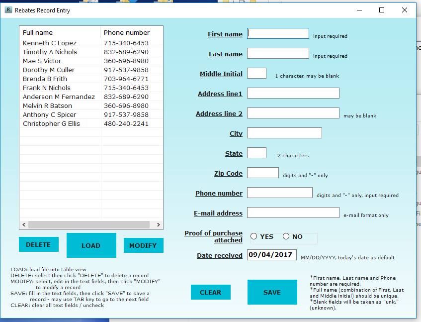
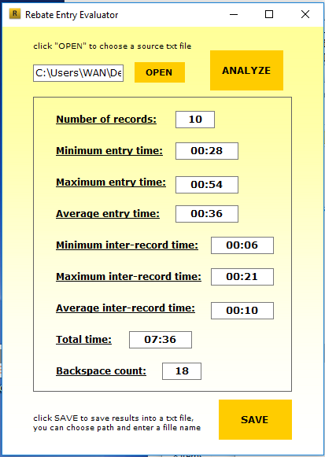
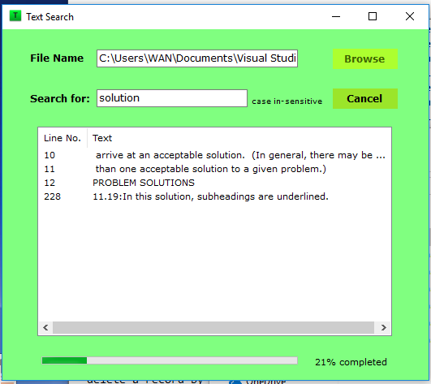
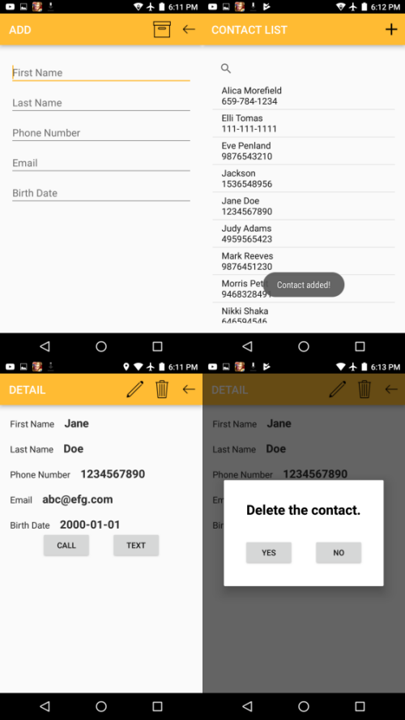

# 2017 Spring Human Computer Interaction CS6326
Instructor: **Mr. John Cole**

This course focuses on the understanding of the **user experience design**.  

## What's inside the folder
- folder `02_[AssignName]` to `05_[AssignName]` contain the source code for assignment 2-5

- folder `UsefulDocs` contains the requirements of the assignments and snapshots

## How to run
Please refer to the readme file of each assignment folder.

## Intro of the Assignments
The topics for assignment 2-5 include screen design for various kinds of user input, design of on-screen controls, etc.  

All the following applications pay special attention to create a **clean**, **easy-to-use interface** to the users. Some principles for better human-computer interaction are applied.

### Assignment2
C# / Visual Studio desktop Application: **Rebate Entry**

- A data entry application. Save both user information and entering information of the entry into a text file.
- Keywords: text file I/O, mouselistener, Usability, Error Prevention, etc.

### Assignment3
C# / Visual Studio Desktop Application: **Rebate Entry Evaluator**

- This application is to evaluate the data the previous assignment creates. It provides the user with the feedback about his or her entry work: the number of records, total time, average entry time, etc.
- Keywords: Usability, evaluation of UI design, data analysis, etc.

### Assignment4
C# / Visual Studio Desktop Application: **Text Search with Progress Bar**

- A simple program that searches a word or a segment of word in a text file. This program is a practice for multithreading in HCI design, using two threads: "UI thread" and the "backgroundworker". The text searching thread is behind the UI thread; users have the choice to cancel the search and there is a progress bar to indicate the searching progress.
- Keywords: Responsiveness, Visibility, cancel button, precise progress bar, etc.

### Assignment5
Java / Android Studio Mobile Application: **Contact Manager**

- A tiny Android phone application. Users could add, modify and delete their contacts information.
- Keywords: text file I/O, clean interface, Consistency, etc.

